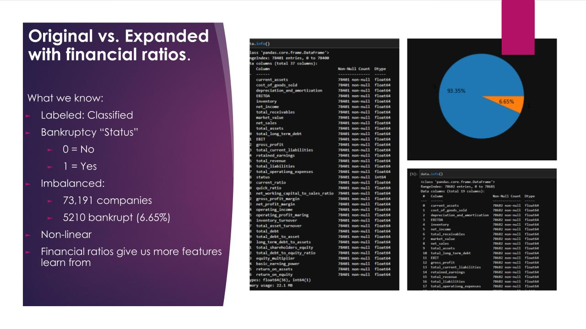
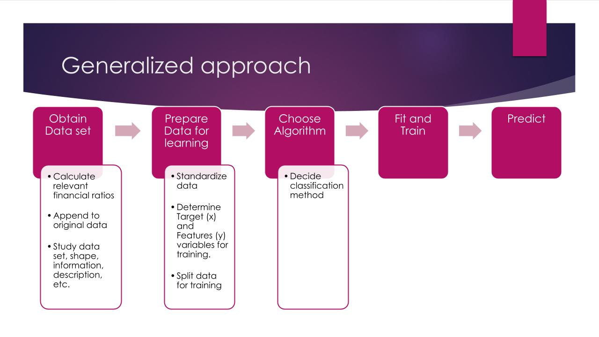

# Predicting Bankruptcy with Machine Learning

## Project Description / Outline

Predicting Bankruptcy involves examining various financial performance measures of financially distressed firms.

This process is important for financial institutions and investors as they evaluate performance and make predictions to manage lending risks.

This project uses financial data NASDAQ and incorporates machine learning classification algorithms to determine bankruptcy predictions.

# Goal of this Project
Predict if company will go bankrupt within a given period of time based on data gathered.

# Members

- [Amrita Prithiani](https://github.com/amritaprithiani)
- [Jeremy Vargas](https://github.com/JeremyPVargas)
- Yu Takahashi

# Datasets

Data used among this project is gathered at the link below

- [Github Repository](https://github.com/sowide/bankruptcy_dataset)
- [Bankruptcy American Dataset](Resources/american_bankruptcy_dataset)

### Data Overview

# Procedure

Description of common approach to solve the research question

# Technologies and analysis
## Machine Learning prediction Models
### `scikit-learn` models
- ADA Boost Classifier
    - [Analysis](jeremy_models/adaboost.ipynb)
- Logistic Regression
    - [Analysis](jeremy_models/data_ratios.ipynb)
- SVC kernel='rbf'
- MLP Classifier
    - [Analysis](yu_models/machine_learning.ipynb)
- Random Forest Classifier
- Decision Tree Classifier
    - [Analysis](amrita_models/Company_bankruptcy.ipynb)

### `imbalanced-learn` models
- Easy Ensemble Classifier
- RUS Boost classifier
- Balanced Random Forest Classifier
    - [Analysis](yu_models/machine_learning.ipynb)

### `Tensorflow Keras` model
- Sequential
    - [Analysis: Different Nodes](yu_models/neural_network_mod_nodes.ipynb)
    - [Analysis: Different Parameters](yu_models/neural_network_mod_methods.ipynb)

---
## Cross Validation Model
### `scikit-learn` model
- KFold
    - [Analysis](amrita_models/Company_bankruptcy.ipynb)

---
## Data Manipulation Models
### `scikit-learn` models
- Standard Scaler
- Train Test Split
- Classification Report
- Balanced Accuracy Score
- Confusion Matrix
- Principal Component Analysis
- Non-negative Matrix Factorization

### `imbalanced-learn` models
- SMOTE
- SMOTEENN
- SMOTETomek
- Random Under Sampler
- Cluster Centroids
- Near Miss

---
## Other Libraries
- Pandas
- Numpy
- joblib
- pathlib
- matplotlib
- yahoo_fin

# Conclusion

Random Forest Classifier had the best performance which is validated via KFold cross-validation